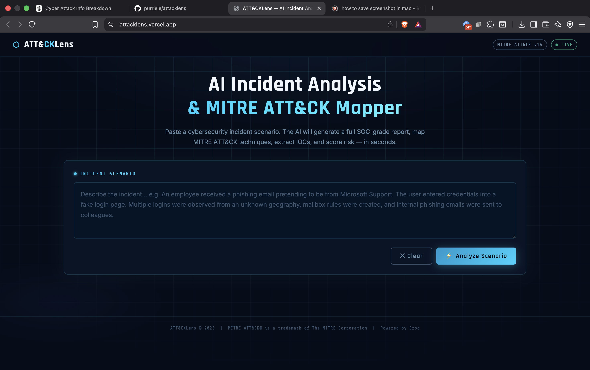
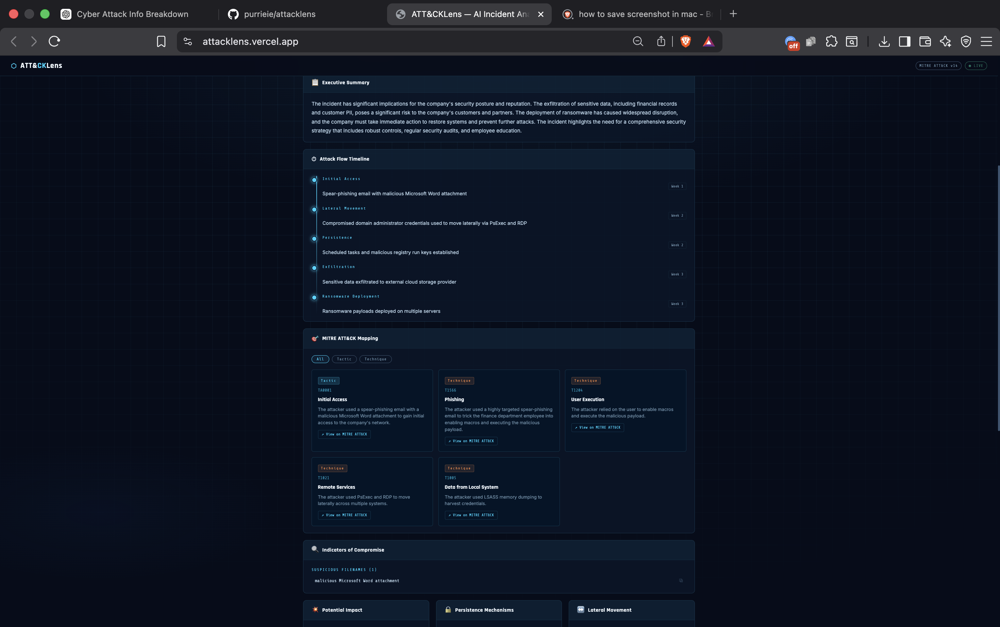
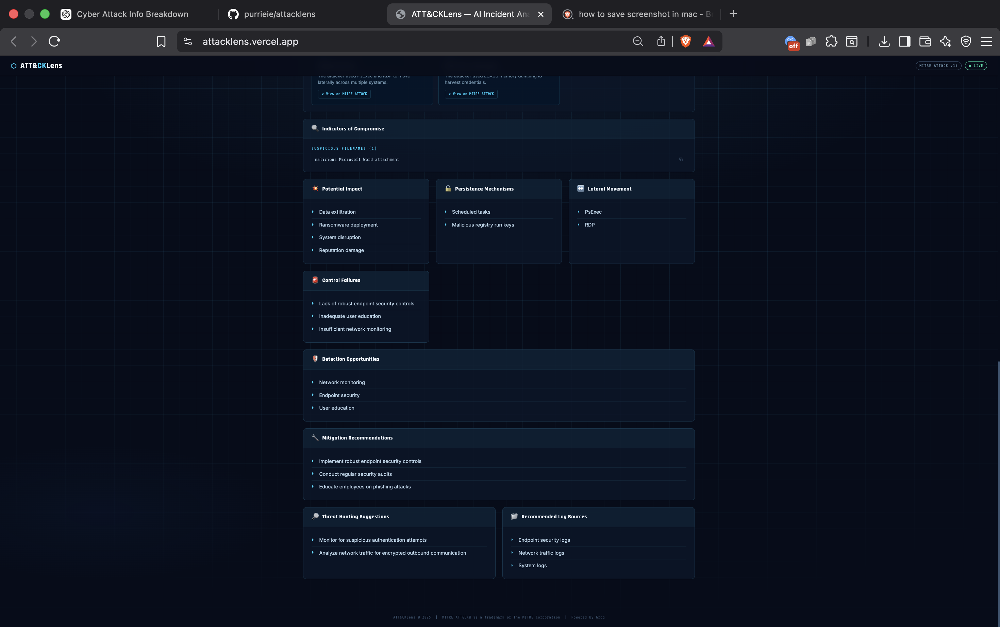
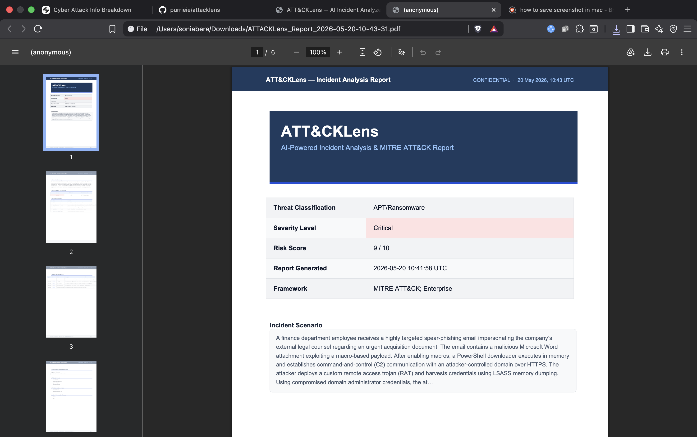
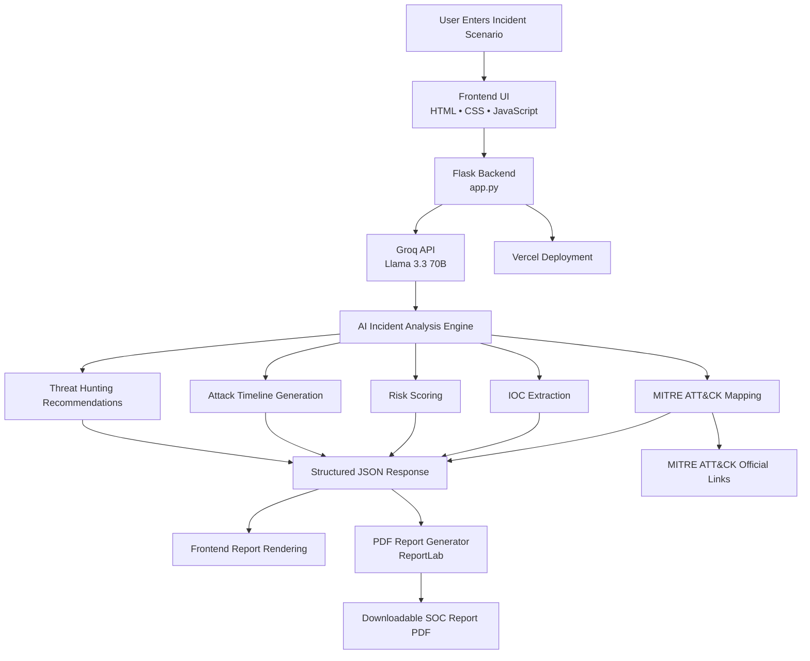

# ATT&CKLens — AI Incident Analysis & MITRE ATT&CK Mapper

AI-powered cybersecurity incident analysis platform with automated MITRE ATT&CK mapping, IOC extraction, and SOC-style reporting.
Paste a plain-English incident scenario → get a full SOC-grade report with MITRE ATT&CK mapping, IOC extraction, risk scoring, attack timeline, and a downloadable PDF report.

---

## Stack

| Layer    | Technology                        |
|----------|-----------------------------------|
| Backend  | Python 3.10+, Flask, Groq SDK     |
| Frontend | HTML, CSS, Vanilla JavaScript     |
| LLM      | Groq (llama-3.3-70b-versatile)    |
| PDF      | ReportLab                         |

---

## Screenshots

## Screenshots

### Home Page


### Analysis Dashboard


### MITRE Mapping


### PDF Report


## Quick Start

### 1 — Clone / download the project

```bash
cd attacklens
```

### 2 — Create and activate a virtual environment

```bash
# macOS / Linux
python3 -m venv venv
source venv/bin/activate

# Windows (Command Prompt)
python -m venv venv
venv\Scripts\activate.bat

# Windows (PowerShell)
python -m venv venv
venv\Scripts\Activate.ps1
```

### 3 — Install dependencies

```bash
pip install -r requirements.txt
```

### 4 — Add your Groq API key

```bash
GROQ_API_KEY=your_key_here
```

Get a free key at: https://console.groq.com/keys

### 5 — Run the Flask app

```bash
python app.py
```

Open your browser at: **http://127.0.0.1:5000**

---

## Usage

1. Paste a cybersecurity incident scenario into the text area.
2. Click **Analyze Scenario** (or press `Ctrl+Enter`).
3. Wait ~10–15 seconds for the AI to process.
4. Browse the full report: summary, timeline, MITRE cards, IOCs, mitigations.
5. Click **Download PDF Report** for a professionally formatted PDF.

### Sample scenario to test

```
An employee receives a spear-phishing email purportedly from the company's
IT helpdesk asking them to verify their Microsoft 365 credentials. The user
clicks the link and enters credentials on a convincing fake page hosted on a
recently registered domain (microsoft-helpdesk-verify[.]com). Shortly after,
sign-ins are observed from an IP address in Eastern Europe. The attacker
accesses the victim's mailbox, creates a forwarding rule to an external
Gmail address, and sends internal phishing emails to the finance team
requesting urgent wire transfers. A second employee in finance clicks a
link, triggering PowerShell execution. Lateral movement is observed using
compromised service account credentials obtained via LSASS memory dump.
```

---

## Project Structure

```
attacklens/
├── app.py              ← Flask backend + Groq + PDF generator
├── requirements.txt
├── .env.example
├── README.md
├── static/
│   ├── style.css       ← Custom dark cyberpunk CSS
│   └── script.js       ← Frontend logic
└── templates/
    └── index.html      ← Main HTML template
```

---

## PDF Report Contents

The generated PDF includes:

- Cover page with metadata (severity, risk score, threat classification)
- Executive Summary
- Severity & Risk Assessment table
- Attack Flow Timeline
- Full MITRE ATT&CK mapping table (with IDs and URLs)
- IOC tables (IPs, domains, emails, hashes, filenames)
- Potential Impact
- Persistence Mechanisms
- Lateral Movement Indicators
- Detection Opportunities
- Mitigation Recommendations
- Threat Hunting Suggestions
- Recommended Log Sources
- Security Control Failures
- Disclaimer footer

---
## Architecture Diagram


## Notes

- The app requires an active internet connection to reach the Groq API.
- MITRE ATT&CK URLs in both the UI and PDF link to the official MITRE website.
- All findings are AI-generated and should be validated by a qualified analyst.

---

## License

MIT — for educational and research use.  
MITRE ATT&CK® is a registered trademark of The MITRE Corporation.
